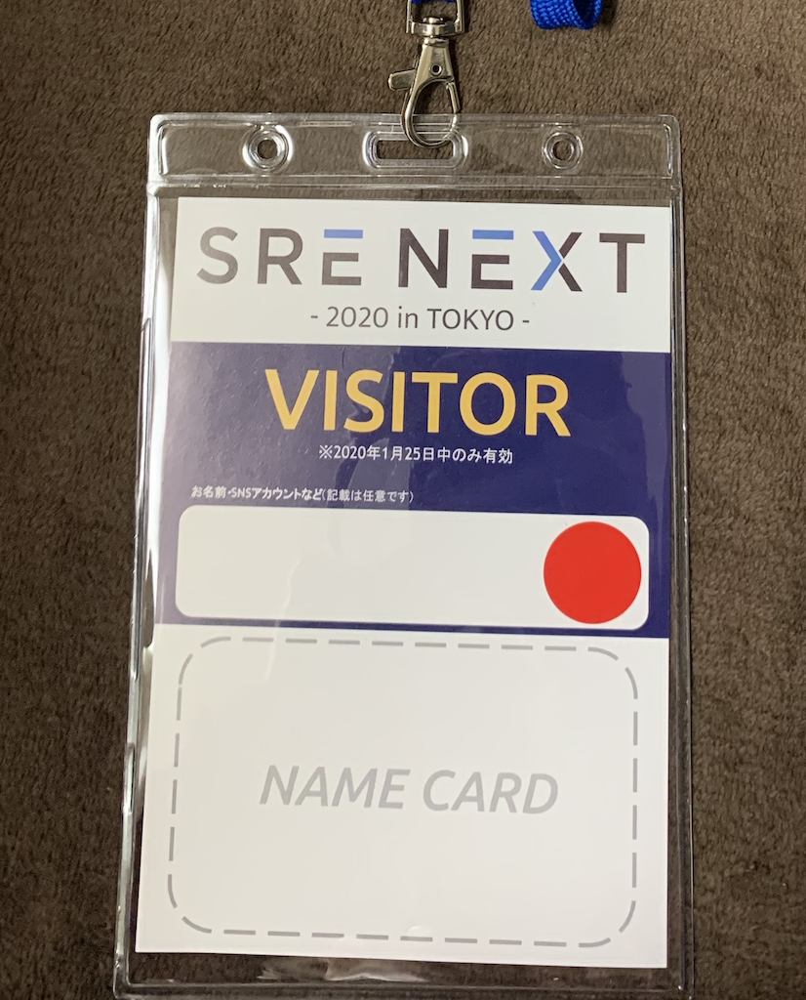
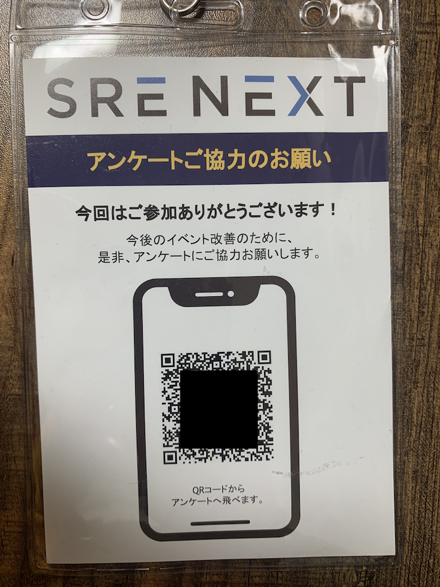
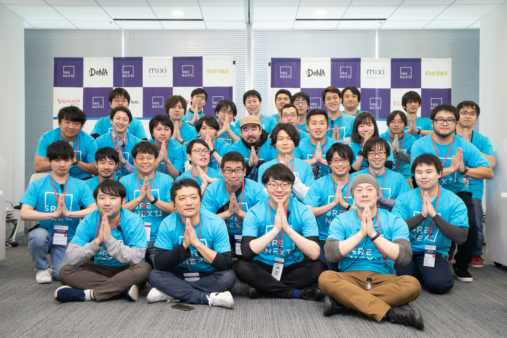

## SRE NEXT 2020 ありがとうございました！

[ogady](https://twitter.com/gadyma)です！

1/25(土) に SRE NEXT 2020 という、SRE についての国内初カンファレンスが開催され、私は運営コアスタッフとして参加しました。

<iframe src="https://hatenablog-parts.com/embed?url=https%3A%2F%2Fsre-next.dev%2F" title="SRE NEXT 2020" class="embed-card embed-webcard" scrolling="no" frameborder="0" style="margin: 10px 0px; padding: 0px; border: 0px; outline: 0px; font-size: 15px; vertical-align: baseline; background: rgb(255, 255, 255); max-width: 500px; color: rgb(77, 77, 77); font-family: TitilliumText22LRegular, &quot;ヒラギノ角ゴ Pro W3&quot;, &quot;Hiragino Kaku Gothic Pro&quot;, メイリオ, Meiryo, &quot;ＭＳ Ｐゴシック&quot;, &quot;MS PGothic&quot;, sans-serif; font-style: normal; font-variant-ligatures: normal; font-variant-caps: normal; font-weight: 400; letter-spacing: normal; orphans: 2; text-align: left; text-indent: 0px; text-transform: none; white-space: normal; widows: 2; word-spacing: 0px; -webkit-text-stroke-width: 0px; text-decoration-style: initial; text-decoration-color: initial; display: block; width: 500px; height: 155px;"></iframe>

カンファレンス運営は初参加で不安だったのですが、**運営チームの方々が暖かく**、すぐに馴染むことができました。ありがとうございます！

また、**当日のお客さま、スポンサーさま、登壇者さま、本当にありがとうございました。**

みなさまのおかげで、**SRE の盛り上がりと、カンファレンス運営の楽しさを最前列で堪能できた**と感じています！

運営側から**「参加ブログを書くまでが SRE NEXT」**と宣ってしまったので、スタッフとしての振り返りを書いていきます。

## 運営スタッフ参加のきっかけ

### 11 月中旬から途中参加

私が[SRE Lounge](https://sre-lounge.connpass.com/) #11 に行った時に、すでに運営コアスタッフ参加していた[@nari](https://twitter.com/fukubaka0825)さんと会い、コアスタッフに誘われたのがきっかけです。彼とは大学の時からの友達かつ前職の後輩という関係で、私が SRE に興味があるをこと知って、スタッフに誘ってくれました。

丁度、運営内部側でコアスタッフ増員を検討していたようで、そのタイミングで SRE Lounge に参加したのは、なんかの縁だったのかもしれないです。

### カンファレンス運営は初体験

最初にも書きましたが、カンファレンス運営は初 + 途中参加だったので、今どんなタスクがあるのか？どうやって進めていくのがいいのか？等、全然分からず不安でした。しかし、途中参加者へのオンボーディングがとても丁寧で、割とすぐにキャッチアップすることができました。具体的には、

- 運用フロー、資料の場所などの「知っておくべきこと」が全て[backlog](https://backlog.com/ja/)に Wiki 化されている。
- 入ってすぐに顔合わせを兼ねた WEB 会議を開催してくれた。
- 意見や、質問に対して爆速でレスポンスしてくれる。（これが一番ありがたかったです！）

これがなかったら心が弱い私は最後まで走りきれなかったかもしれません。

## 担当したこと

### 名札の作成

参加者が当日ぶら下げる名札をデザインから発注まで担当しました。

検討ポイントとしては、以下のような感じです。

- 会場ビルの警備の方が、すぐに SRE NEXT の参加者だとわかること
- 参加者同士が交流しやすいよう、名前スペースや、名刺入れスペースを用意
- 参加者がアンケートに回答しやすいように、アンケートの QR コードを裏面に記載
- 色は、SRE 本と同じ紺色を基調とする
- 懇親会参加者は赤いシールで識別

休日のビル入館なので、事前に警備の人に名札を連携する必要があったり（ここは[@ykawamot](https://twitter.com/ykawamot)さんに大変お世話になりました。ありがとうございます！）、どんな要素で構成すれば参加者が扱いやすい名札になるかなど、結構悩んだところが多かったです。小さいところですが、**デザインで UX を高めるためには何が必要かを本気で考える機会**になりました。

発注は印刷ではおなじみ[ラクスル](https://raksul.com/)さんにしました。印刷崩れしないテンプレートや、発送日によって金額を選べるなど、わかりやすく柔軟に対応できてとてもよかったですね。

完成品はこちら。

- 表面
  　

- 裏面
  　

### 参加者ストラップの発注

参加者をストラップに見分けられるように、参加者の枠で色分けしました。

これは[HOT STRAP](https://hotstrap.jp/)さんの即納商品を使用しました。即日発送かつカラバリも豊富なので、3 日前に発注ミスに気がついてもギリ対応できる安心感があります。

### 当日司会（RoomC）

当日は Room C の司会として、Room リーダーの[@mshibuya](https://twitter.com/m4buya)さんや、音響映像担当の[@sogaoh](https://twitter.com/sogaoh)さんと連携して Room C を円滑に回すよう心がけました。また、当日スタッフで入ってくれた[@kato](https://twitter.com/kuromitsu_ka)さん、[@sakutaro](https://twitter.com/saku_238)さん、[@Mitsu](https://twitter.com/_mttrs)さん、会場誘導やタイムキープに入っていただきました。ただ、最初のセッションで想像以上の方が来てくれて、**部屋が立ち見でパンパンになる**、という展開にテンパってしまい、**めちゃめちゃ噛んでいた**し、スムーズな司会とはいかなかったです。。。

アナウンスでは、

- WiFi 情報、ハッシュタグなどの、参加者が必要とするアナウンスはできるだけ繰り返す。
- スポンサーブースの案内、アンケート協力などの、是非聞いてほしいアナウンスは人が多いタイミングを見て、強調してアナウンスする。

あたりを意識していました。アナウンス頻度を調整するのが悩ましく、ここは他のカンファレンス司会者を参考にしたり、ひたすら経験を積むしかないのかなと思いました。これまでに参加したカンファレンスでアナウンスをもっと注意して聞いておけばよかった。。。

当日最大のピンチは、最後の基調講演のサテライト配信でした。**講演が始まっても配信映像が映らないというアクシデント**があり、復旧するまで 5 分ほどかかってしまいました。（この時 5 分で済んだのは[@okash1n](https://twitter.com/okash1n)さん、[@Ryoter](https://twitter.com/rabbyrinth_kae2)さんの迅速なヘルプのおかげです。ありがとうございました！）

そのまま流すと、サテライト会場の参加者だけ講演最初の 5 分間を見逃す、という事態になってしまいます。そのため、**急遽タイムシフトに切り替え、実際の講演から 5 分遅れてスタートさせる**という判断を取り、参加者の方にアナウンスしました。改めて、ご迷惑おかけして申し訳ありませんでした。。。

後から参加者の方のツイートを拝見していたら、こういったツイートを見つけて少し救われました。

<blockquote class="twitter-tweet">
最初の部分が途切れてしまったので、巻き戻して配信開始しはった  すごい迅速な判断と対応<a href="https://twitter.com/hashtag/srenextC?src=hash&amp;ref_src=twsrc%5Etfw">#srenextC</a>
&mdash; たっち/Tatch/它龇牙咧嘴 (@TatchNicolas) <a href="https://twitter.com/TatchNicolas/status/1220995058066845696?ref_src=twsrc%5Etfw">January 25, 2020</a></blockquote> 

<blockquote class="twitter-tweet">
サテライト、聞きやすくてよかったよ。さらにすいてて快適。。。<a href="https://twitter.com/hashtag/srenext?src=hash&amp;ref_src=twsrc%5Etfw">#srenext</a>
&mdash; Ryo Miura (@ryo_miura_it) <a href="https://twitter.com/ryo_miura_it/status/1221002935837970432?ref_src=twsrc%5Etfw">January 25, 2020</a></blockquote> 

### 当日ツイートの Togetter まとめ

「鉄は熱いうちに叩け」と言わんばかりに、その日のうちに Togetter まとめを作成し、メンバーの内容確認後、翌日公開しました。この辺はスピーディに動けば動くほど効果があるので、いい動きができたかなと思います。

知見だったのが、`#srenext` が Twitter トレンド入りしていたため、**Bot 達の餌食**になっていて、まとめるときに Bot が混入していないかを気をつける必要がありました。

- [SRE NEXT 2020 まとめ（オープンニング前）](https://togetter.com/li/1460267)
- [SRE NEXT 2020 まとめ（前半戦）](https://togetter.com/li/1460258)
- [SRE NEXT 2020 まとめ（後半戦）](https://togetter.com/li/1460260)
- [SRE NEXT 2020 まとめ（懇親会）](https://togetter.com/li/1460262)

### YouTube 動画公開

これはこれからのタスク。。。

## 振り返り

初のカンファレンス運営参加でしたが、どう考えても反省点の方が多いです。

- 名札ケースがサイズぴったりすぎて、名前書く欄があるのに出し入れしにくい & 事前に詰める作業が大変

  → 次回からは分厚目の名札（ケース無し）などにして、ケースのコストカットと、参加者のユーザビリティ向上を目指す。

- 司会のマニュアルの作り込みが足りず、登壇者への紹介動画タイミング説明や、アクシデント時の対応はアドリブで乗り切ることになってしまいテンパった。

  → トラブルを想定したマニュアル作成や、音響映像スタッフとの連携フロー決め、登壇者への事前説明などを行い、**当日、脳のワーキングメモリにできるだけ負荷をかけない**工夫をする。

- 運営参加当初、ビビってタスクを取りにいく積極性に欠けていた。

  →「途中参加だから」とか「初経験だし」とビビって遠慮するのはマジで無駄。むしろ、**タスクをどんどんとってバリューを出すことで信頼を得るような動きをすることが大事**。実際、同じタイミングで参加してどんどんタスク消化していく人は沢山いた。

一方で、この**イベントに運営として参加したことの価値はとても大きかった**です。

やったことないタスクに放り出されることで自分のできること、苦手なことが明確になったし、上記のような学びもありました。また、当日の熱量で、SRE の盛り上がりを感じることができました。

懇親会で話した方が「SRE ってロールがテーマになってるカンファレンスってやばい。バックエンドエンジニア Con みたいなことだからねこれ、そんなの普通ないでしょ（笑）」と言っていたのが印象的でしたが、それだけ SRE の関心の高さと、多くの人が手探り状態で知見を欲しがっているテーマだということも再認識しました。

私の今いる会社でもそろそろ SRE チームを新設する予定で、SRE NEXT で得た知見を還元していこうと思っています。

最後にオープニング前のヨガらしきポーズをとるスタッフ一同（私は真ん中の帽子の人(nari)の左）

photo by [@weekendcycler](https://twitter.com/weekendcycler)
